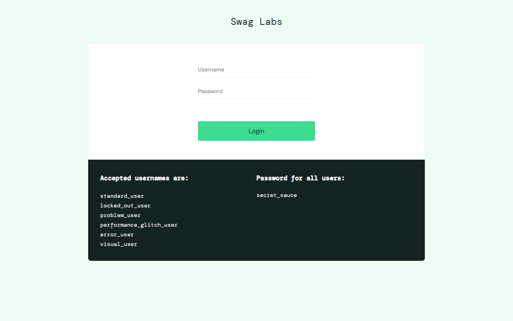
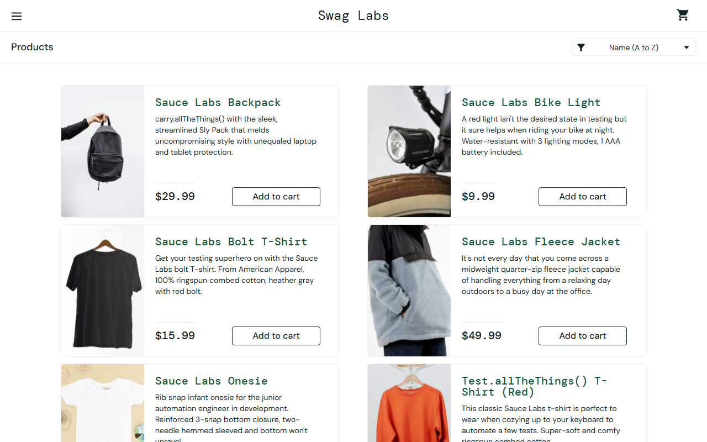
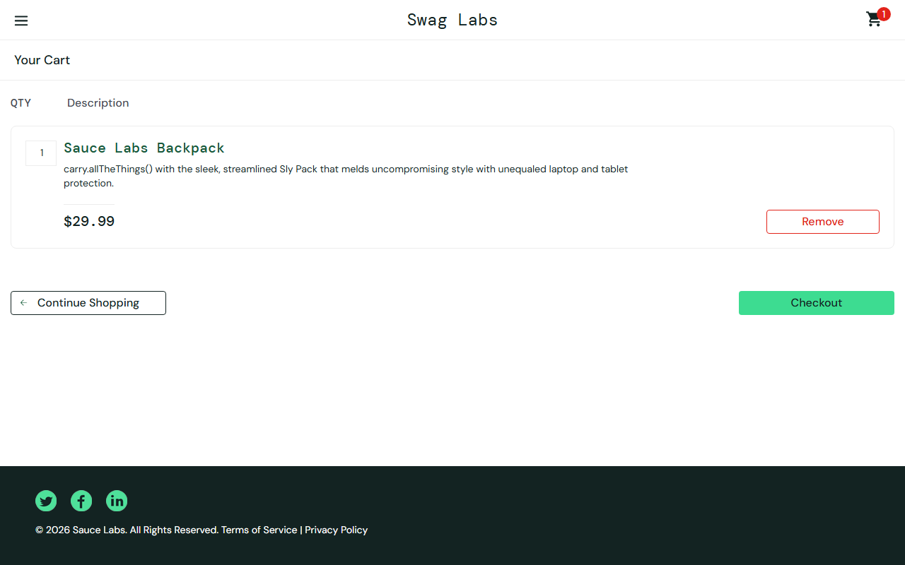

# 🎭 Playwright Automation Showcase — Test Automation Engineer Portfolio

> Production-grade **Playwright + TypeScript** framework showcasing E2E, API, **Visual Regression**, **Accessibility** & **Allure Reporting** across **multiple environments** — built on real-world apps.

[](https://github.com/sebastian-cichon/playwright-automation-showcase/actions/workflows/playwright.yml)
[](https://sebastian-cichon.github.io/playwright-automation-showcase/)


---

## 🎯 What This Showcases

| Skill | Demonstrated By |
|-------|----------------|
| **Playwright + TypeScript** | Strict TS, POM, fixtures, `data-test` locators |
| **Real E2E Scenarios** | Full checkout on [SauceDemo](https://www.saucedemo.com) |
| **Visual Regression** | `toHaveScreenshot()` with thresholds, masking, mobile |
| **Accessibility (a11y)** | `@axe-core/playwright` WCAG 2.1, `tests/a11y/a11y.spec.ts` |
| **Auth Optimization** | `storageState` via `tests/setup/auth.setup.ts` — 10x faster suite |
| **Multi-Environment** | `ENV=dev\|staging\|prod` via `config/environments.ts` + CI matrix |
| **API Testing** | Playwright `request` — GET/POST, schema, chaining |
| **Reporting** | HTML + JUnit + **Allure** (`allure-playwright`) → GitHub Pages |
| **CI/CD** | GitHub Actions matrix (env × browser) + Allure Pages |

## 🚀 Quick Start

```bash
git clone https://github.com/sebastian-cichon/playwright-automation-showcase.git
cd playwright-automation-showcase
npm ci
npx playwright install --with-deps
cp .env.example .env
npm test
npm run test:ui   # UI mode
```

## 🌍 Environments

```bash
npm run test:dev
npm run test:staging
npm run test:prod
ENV=staging npx playwright test
```

## 👁️ Visual Regression

Visual tests catch unintended UI changes via Playwright's native `toHaveScreenshot()` (threshold `0.2`, `maxDiffPixels: 100`, masking dynamic badges).

```bash
npm run test:visual -- --update-snapshots  # baselines
npm run test:visual:ci                     # CI check
```

| Baseline example (SauceDemo) | What is checked |
|---|---|
|  | Login form layout, logo, inputs — full page |
|  | Product grid, sort dropdown, cart badge |
|  | Cart items, checkout button, totals |

> **How it works in CI:** Dedicated `visual` project (`playwright.config.ts:63`) runs only on `pull_request` (`playwright.yml` + `visual-update.yml`). On failure, diff PNG is attached to the HTML report (`test-results/`).  
> **Portfolio tip:** In a PR, the diff is visible in the uploaded `playwright-report` artifact — share the PR URL in interviews.

**Techniques showcased:**
- `await expect(page).toHaveScreenshot('login-page.png')` with `threshold`/`maxDiffPixels`
- Masking flaky badges: `{ mask: [page.locator('.shopping_cart_badge')] }`
- Responsive: `page.setViewportSize({ width: 375, height: 812 })` → `login-mobile.png`
- Dedicated `visual` project for stability (chromium only)

> Snapshots are OS-specific (`-linux` on CI vs `-win32` local). Generate Linux baselines via **Actions → Update Visual Baselines → Run workflow**.

## 🔌 API Tests

```bash
npm run test:api
```

## ♿ Accessibility (a11y)

```bash
npx playwright test --project=a11y          # axe WCAG 2.1
npx playwright test tests/a11y --reporter=html
```

Checks via `AxeBuilder`: `wcag2a`, `wcag2aa`, critical/serious gate, attachments in HTML report. Also manual checks: `alt` text, heading hierarchy.

## 🔐 Auth Reuse (storageState)

```bash
npx playwright test --project=setup   # creates playwright/.auth/user.json
npx playwright test --project=chromium # reuses session (no login)
```

Setup project `tests/setup/auth.setup.ts` logs in once → `dependencies: ['setup']` in `playwright.config.ts`. Shows senior optimization: avoids 20x logins.

## 📊 Allure Report

```bash
npm run test:allure          # generates allure-results
npm run report:allure        # serves allure-report locally
```

CI: `allure-pages.yml` publishes to **GitHub Pages** → https://sebastian-cichon.github.io/playwright-automation-showcase/ (enable Pages: Settings → Pages → Source: GitHub Actions).

## 🚀 Releases — Automation Reports

Every release bundles the executable Playwright reports (no need to hunt artifacts).

**Trigger a release:**

```bash
# Option A — manual (recommended for portfolio):
gh workflow run release.yml -f tag=v1.0.0
# or GitHub UI: Actions → Release with Reports → Run workflow → tag: v1.0.0

# Option B — tag push:
git tag v1.0.0 && git push origin v1.0.0
```

**What you get in the Release (`Releases` tab):**

- `playwright-report.zip` — open `index.html` or `npx playwright show-report`
- `allure-report.zip` — `allure open allure-report`
- `allure-results.zip` — raw results for history/trends
- `junit.xml` — for dashboards
- Auto-generated `REPORT_SUMMARY.md`

Workflow: `.github/workflows/release.yml` runs `chromium` + `api` + `a11y` with `html,allure-playwright,junit` reporters, builds `allure-report`, zips assets, and creates the Release via `softprops/action-gh-release`.

> The latest release is linkable in your CV: `https://github.com/sebastian-cichon/playwright-automation-showcase/releases/latest` → shows stakeholders the actual HTML report.

---

Built to be forked and discussed in interviews. Happy testing! 🎭
